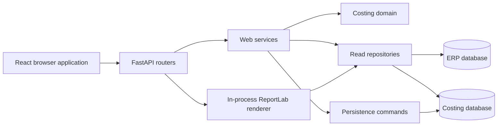

# Application architecture

This project is organized so transport, orchestration, database access, and cost
calculation can change independently. The root-level compatibility modules remain
small and stable for existing launch commands and integrations.

## Request and data flow

The main boundaries are:

- `api.py` is the deployment compatibility entry point. `api:app` must remain
  importable by Uvicorn, containers, and existing service definitions.
- `web/` owns HTTP concerns: application construction, authentication dependencies,
  request/response schemas, serialization, route handlers, and request-level
  orchestration.
- `repositories/` owns read queries. ERP queries and costing-database queries are
  separated so a change to one database does not obscure the other.
- `utils/queries.py` is a compatibility facade for existing imports. New SQL belongs
  in `repositories/`; callers that still import the old module keep the same public
  functions.
- `costing/` owns calculations and write-side persistence. Calculation modules work
  with data frames and records without depending on FastAPI.
- `frontend/src/` is the authored browser source. `api/`, `domain/`, `components/`,
  and `features/` separate shared response handling, pure rules, reusable UI, and
  feature views.
- `static/dist/` is generated by the frontend build and is not authored by hand.
  `static/index.html` is the server-rendered shell that loads those bundles.
- `database/` contains the destructive current-schema reset and ordered migrations.
- `reporting/` contains the pure-Python ReportLab document and a small facade that
  loads the saved costing snapshot. It runs identically on Linux and Windows and
  has no external report-runtime dependency.

## Backend responsibilities

### HTTP layer

Routers are grouped by user-facing capability rather than by implementation detail:
costing runs, catalog/search lookups, settings, administration, and system status.
Route handlers validate inputs and translate known domain or storage errors into HTTP
responses. They should not contain SQL or duplicate calculation formulas.

`web/services.py` coordinates multi-step use cases such as loading an ERP method,
calculating lines, enriching saved runs, and serializing the result. Shared response
normalization belongs in `web/serialization.py`; request models belong in
`web/schemas.py`.

### Data access

`utils/queries.py` retains the established database execution primitives and delegates
query text and read-model assembly to the repository modules. Preserve parameterized
queries and return shapes when moving or changing a query because those column names
are part of the calculation contract.

Writes remain in `costing/persistence.py`. It filters frames against the deployed
database schema to support installations that are on different migration levels.
Schema changes therefore need both a migration and a compatibility review of the
write path.

### Costing domain

- `costing/operations.py` resolves operation defaults and computes machine, labor,
  external-operation, and additional costs.
- `costing/materials.py` resolves purchase/manufactured material sources and computes
  material cost lines.
- `costing/calculator.py` applies markup breaks and assembles part-cost summaries.
- `costing/conversion_calculator.py` contains the unit and geometry conversion rules.
- `costing/common.py` contains small, calculation-oriented normalization helpers.

Keep these modules independent of HTTP request objects. If a rule is used by both an
API route and another caller, it belongs in the domain or service layer rather than a
router.

## Frontend responsibilities

`frontend/src/App.jsx` is the composition root and owns cross-feature loading,
navigation, and parent/child costing flows. Feature modules own their focused views
and interactions, reusable controls belong in `components/`, and `api/` provides
shared response handling. Requests currently stay near the workflow that uses them.
Pure formatting, state-shaping, and calculation helpers belong in `domain/`; those
modules are the preferred place for fast browser-side unit tests.

The browser intentionally previews the same cost relationships that the server
calculates. When a formula changes, update the server implementation, its Python
tests, the matching frontend domain helper, and its JavaScript tests together.

Build the browser application with `pnpm run build`. The build emits one JavaScript
bundle and one CSS bundle under `static/dist/`. Do not edit generated bundles or move
authored source back into the public static directory.

## Compatibility contracts

The following shapes are deliberately retained even where a newer internal structure
exists:

- the `api:app` import path;
- the public functions in `utils/queries.py`;
- the legacy ERP connection alias in `utils/erp_cursor.py`;
- existing API paths, methods, request fields, and persisted column names;
- fallback reads for older pricing/default-cost schemas;
- schema-aware persistence for partially migrated installations.

Removing a compatibility contract requires an explicit migration plan and consumer
review; a code cleanup alone is not sufficient.

## Tests and safe changes

Backend tests are grouped by domain or boundary under `tests/`, with shared costing
fixtures in one support module. `tests/test_api_contract.py` protects the complete
application route surface. Frontend domain tests run separately from the production
bundle build.

For a behavior-preserving change, run both test suites and the production frontend
build. For query or persistence changes, also verify the expected result columns and
review the ordered scripts in `database/`. Never execute `database/reset_schema.sql`
against an environment whose data must be retained.
